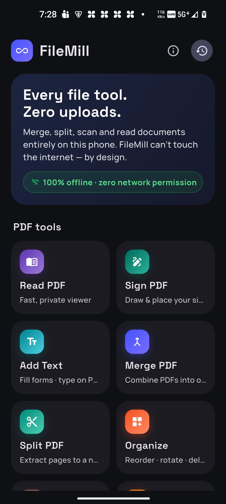
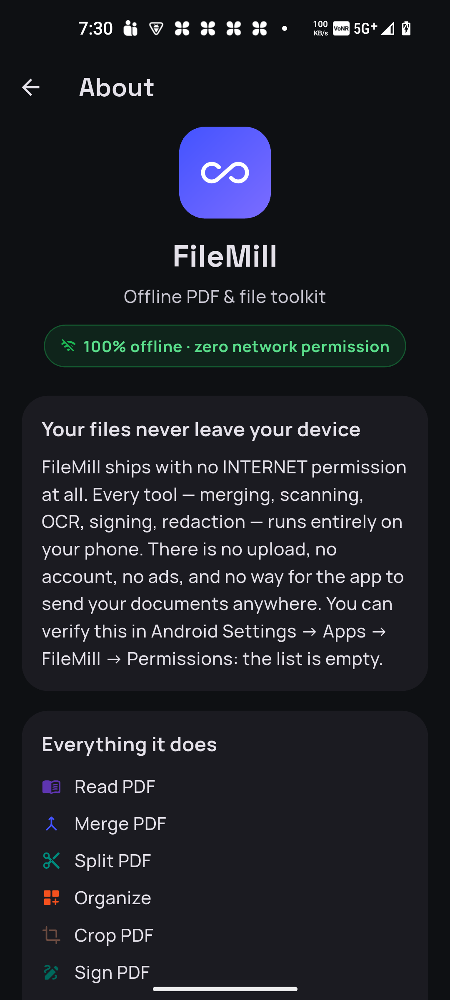

<div align="center">


# FileMill

### Offline PDF & file toolkit — your files never leave your device, *provably*

17 document tools that run **100% on-device**. No upload. No account. No ads. No watermark.
FileMill ships with **zero network permission** — the app literally *cannot* touch the internet.

<br/>


&nbsp;&nbsp;


</div>

---

## The privacy claim, proven

Most "private" PDF apps still upload your files to a server. FileMill can't — it declares **no `INTERNET` permission** in its release manifest. You can verify it yourself:

```console
$ aapt dump permissions app-release.apk
package: com.filemill.filemill
uses-permission: ...DYNAMIC_RECEIVER_NOT_EXPORTED_PERMISSION   # AndroidX internal only
# no INTERNET, no ACCESS_NETWORK_STATE — nothing
```

On the phone: **Settings → Apps → FileMill → Permissions** — the list is empty. Even the on-device OCR model and the bundled fonts mean nothing ever phones home.

## What it does

**PDF tools**

| | | |
|---|---|---|
| 📖 **Read** — fast pinch-zoom viewer, "Open with" integration | ✍️ **Sign** — draw & place your signature | ⌨️ **Add Text** — fill flat forms, styled vector text |
| 🔀 **Merge** — combine PDFs, drag to order | ✂️ **Split** — extract any pages | 🎛 **Organize** — reorder, rotate, delete pages |
| 🖼 **Crop** — trim margins, auto-detect content | 🗜 **Compress** — quality presets or "fit under X MB" | 🔒 **Protect** — AES-256 lock / unlock |
| 🖊 **Highlight** — color markup, find-to-highlight | ⬛ **Redact** — *truly* destroys content, not just covers it | 💧 **Watermark** — diagonal stamps + page numbers |
| 🌄 **PDF → Images** — export pages as PNG/JPG | | |

**Create & capture**

| | | |
|---|---|---|
| 📷 **Scan → PDF** — auto edge-detect, deskew, enhance | 🏞 **Images → PDF** — photos into a clean PDF | 🔤 **Extract Text** — on-device OCR |
| 🔎 **Searchable PDF** — invisible OCR text layer over scans | 🔄 **Convert Images** — JPG/PNG, resize, shrink | |

## Highlights worth a closer look

- **Redact** flattens affected pages to images so the hidden text is *destroyed*, not painted over — a text-extractor over the output finds nothing (there's a unit test that proves it). Black-out or pixelate, with labels.
- **Searchable PDF** re-renders each scanned page and lays an invisible, positioned OCR text layer over it — the scan looks identical but becomes searchable and copy-able.
- **Find & mark** — search a term and every occurrence is highlighted or redacted at once.
- **Scan** does real perspective correction (4-point homography) + auto-enhance, entirely in pure Dart.
- **Share-sheet & "Open with"** — FileMill appears wherever you share or open a PDF/image.

## Built with

Flutter · Google ML Kit (on-device OCR) · Syncfusion & pure-Dart `pdf` engines · `pdfx` rendering · isolate-based processing for a smooth UI · Storage Access Framework (no storage permissions) · bundled Manrope + Space Grotesk fonts.

## Build

```console
flutter pub get
flutter build apk --release          # or --split-per-abi for smaller APKs
```

Requires Flutter 3.41+, Android minSdk 24.

---

<div align="center">
<em>Milled locally. Nothing ever uploaded.</em>
</div>
